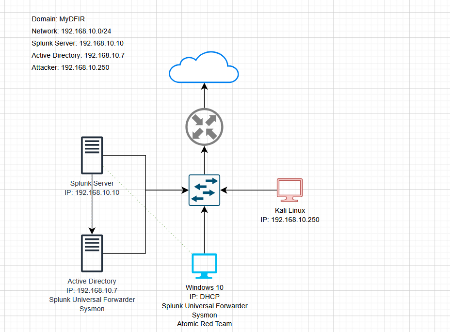

# Active Directory Security Lab

## 📌 About This Project
This is a home lab I built to learn how Active Directory works, how Windows logs security events,  
and how attacks look from a defender’s point of view.  
The lab was inspired by the myDFIR Active Directory Series on YouTube.

---

## 🖥️ Lab Environment
This lab was created using VirtualBox and includes:

- **Windows Server 2022** – Active Directory Domain Controller  
- **Windows 10** – Domain-joined workstation  
- **Kali Linux** – Attacker machine  
- **Ubuntu Server** – Splunk log server  

---

### 🔧 Network Diagram  

---

## 🛠️ Tools Used
- **Splunk Enterprise**  
- **Splunk Universal Forwarder**  
- **Sysmon**  
- **Hydra** (used instead of Crowbar due to compatibility issues on modern Kali)  
- **Atomic Red Team**  
- **VirtualBox**

---

## ✅ What I Did
- Installed and configured Active Directory  
- Created domain users and organizational units  
- Joined Windows 10 to the domain  
- Installed Sysmon and forwarded logs into Splunk  
- Performed an RDP brute-force attack using **Hydra**  
- Detected failed & successful login events in Splunk  
- Installed **Atomic Red Team** to simulate attacker behaviors  
- Verified visibility of techniques through Windows Event Logs & Splunk  

---

## 📚 What I Learned
- How Active Directory authentication works  
- How Windows logs security-related events  
- How RDP brute force attacks appear in Event Viewer & Splunk  
- How to investigate Event IDs **4625** (failed logon) and **4624** (successful logon)  
- How SIEM tools help defenders detect malicious behavior  
- How to generate ATT&CK-mapped telemetry using Atomic Red Team  

---

## ⚠️ Disclaimer
This project was created in a **safe, isolated home lab** for educational purposes only.  
Brute force testing should **never** be used on systems you do not own or manage.

